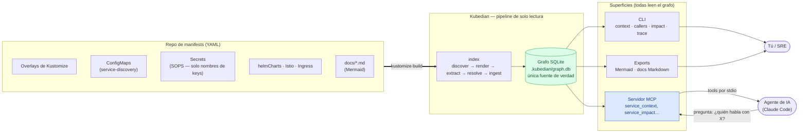

# Kubedian

**Una herramienta nativa de Kubernetes para entender cómo se relacionan realmente tus servicios — reconstruido directamente desde los manifests que definen tu clúster.**

Kubernetes describe *qué* corre, pod por pod, pero nunca te dice *cómo encajan tus servicios
entre sí*. Kubedian lee tus manifests como los lee un SRE — a lo largo de archivos, namespaces y
overlays — y reconstruye el grafo de servicios que Kubernetes mismo nunca expone.

> README también disponible en [English](README.md) y [Português](README.pt.md).

## Para qué sirve

Kubedian construye un **grafo de dependencias entre tus servicios**: quién llama a quién por
HTTP, qué base de datos / caché / cola usa cada uno y de qué APIs externas depende. Extrae todo
esto **directo del YAML que ya tienes** — overlays de Kustomize, variables de entorno de los
Deployments, ConfigMaps compartidos, Helm charts, ruteo Istio/Ingress — y lo expone como un
grafo SQLite, un CLI, un servidor MCP para agentes de IA, diagramas Mermaid y documentación
en Markdown.

## El problema que resuelve

Casi todas las herramientas alrededor de los manifests de Kubernetes se quedan en un *archivo
individual*: despliegan YAML, lo templatean, lo validan o lo diffean. **Casi ninguna lee *a lo
largo* de los manifests para responder lo que de verdad importa en un incidente o una
refactorización: "¿qué habla con qué?"** Así que los equipos terminan con diagramas de
arquitectura dibujados a mano que se desactualizan al día siguiente, o grepeando decenas de
overlays manualmente.

Kubedian cierra ese hueco. Trata el repositorio de manifests completo como un solo grafo y
reconstruye la **topología de servicios** desde la realidad del despliegue, de modo que la
respuesta a "¿qué depende de `orders-service`?" o "¿qué se rompe si cae esta base de datos?"
está a un comando (o a una pregunta a tu agente de IA) de distancia — y siempre actualizada,
porque se deriva de los manifests, no se mantiene a mano.

Y lo hace **sin descifrar nunca los secrets**: lee solo los *nombres de las keys* de los
secrets cifrados con SOPS (que quedan en texto plano), jamás sus valores.

## Instalación

```bash
uv tool install kubedian            # o: pipx install kubedian
uvx kubedian index --repo ./manifests   # ejecútalo una vez sin instalar
pip install kubedian                 # core: index + grafo + diagramas + docs
pip install "kubedian[mcp]"          # + servidor MCP
```

Requiere el binario externo [`kustomize`](https://kustomize.io) en el `PATH` para un
renderizado preciso; Kubedian cae a parseo de YAML crudo si falta.

## Uso

```bash
# 1. Indexar el repo de manifests (por defecto, el directorio actual)
kubedian index --env production

# 2. Consultar la topología
kubedian status
kubedian context  orders-service        # quién lo llama, a qué llama, datastores, externos
kubedian callers   catalog-service      # dependencias entrantes
kubedian callees   orders-service        # dependencias salientes
kubedian trace     checkout-service orders-service
kubedian impact    catalog-service      # blast radius si falla
kubedian datastore-clients "db:postgres"   # quién usa un datastore

# 3. Visualizar / documentar
kubedian export-mermaid --focus orders-service   # arquitectura como diagrama Mermaid
kubedian export-docs    --lang all                 # docs en Markdown (en/es/pt)

# 4. Exponerlo a agentes de IA (p.ej. Claude Code) por MCP
kubedian install        # registra el servidor MCP
kubedian serve          # o córrelo directo (stdio)
```

Agrega `--json` a cualquier comando de consulta para salida procesable, y `--env` para apuntar
a un entorno específico (development | staging | production | test).

## Ejemplos — ¿quién habla con quién?

**¿Quién llama a un servicio?**

```console
$ kubedian callers catalog-service --env production
 - checkout-service   (explicit, service-discovery.CATALOG_API_URL)
 - orders-service     (explicit, service-discovery.CATALOG_API_URL)
 - pricing-service    (explicit, service-discovery.CATALOG_API_URL)
 - promo-service      (explicit, service-discovery.CATALOG_API_URL)
 - inventory-service  (explicit, service-discovery.CATALOG_API_URL)
 - delivery-service   (explicit, service-discovery.CATALOG_API_URL)
 - auth-service       (explicit, service-discovery.CATALOG_API_URL)
 - web-frontend       (explicit, service-discovery.CATALOG_API_URL)
 - erp-connector      (explicit, service-discovery.CATALOG_API_URL)
```

**¿A qué le habla un servicio?**

```console
$ kubedian callees checkout-service --env production
 - http_calls → catalog-service   (explicit)
 - http_calls → orders-service    (explicit)
 - http_calls → auth-service      (explicit)
 - reads_from → postgres          (heuristic)
 - caches_in  → redis             (documented)
 - queues_to  → rabbitmq          (heuristic)
```

### Cómo determina Kubedian "quién habla con quién"

Nunca corre el clúster — reconstruye cada arista a partir de una señal concreta en los manifests
(o docs) y la etiqueta con esa señal para que puedas auditarla:

| Señal en el YAML | Arista que genera | Procedencia |
|------------------|-------------------|-------------|
| Una entrada del **ConfigMap** de service-discovery — `CATALOG_API_URL: http://catalog-service.catalog.svc.cluster.local` consumida vía `envFrom` | `checkout-service → catalog-service` (`http_calls`) | `explicit` |
| Una **env var** literal cuyo valor es un DNS interno (`*.svc.cluster.local`) | quien la define → ese servicio (`http_calls`) | `explicit` |
| El **nombre de una key de secret** como `POSTGRES_HOST` / `RABBITMQ_HOST` / `REDIS_URL` (el valor sigue cifrado) | servicio → su base / cola / caché | `heuristic` |
| Una key `*_URL` que apunta a un host no-clúster (p.ej. `EMAIL_API_URL`) | servicio → API externa | `heuristic` |
| Un **diagrama Mermaid** en tu `docs/` que dibuja `A --> B` | `A → B` | `documented` |
| Una entrada `helmCharts[]` / un ConfigMap o Secret montado | `depends_on_chart` / `references` | `explicit` |

Así, la respuesta a *"¿quién le habla a catalog-service?"* se deriva de la key exacta del
ConfigMap que cada llamador monta — no de un diagrama que alguien dibujó una vez. Y cuando la
única evidencia es el nombre de una key de secret, la arista se marca honestamente como
`heuristic` citando la key, nunca como un hecho.

**Trazar una ruta o el blast radius:**

```console
$ kubedian trace web-frontend inventory-service --env production
 web-frontend → inventory-service   (reachable)

$ kubedian impact catalog-service --env production
 9 servicios dependen de él (transitivamente)
```

## Enriquecer el grafo desde tu documentación

Algunas relaciones no están en los manifests: llamadas a SaaS externos, enlaces entre clústeres
o backends cuya dirección vive en un secret cifrado. Si ya documentas eso en **diagramas
Mermaid** dentro de la documentación de tu repo, Kubedian puede ingerirlos:

```bash
kubedian index --docs                 # también parsea los diagramas Mermaid bajo ./docs
kubedian index --docs-dir ./design    # o apunta a una carpeta específica
```

Las aristas extraídas de los docs se agregan con procedencia `documented` (confianza 0.9). Esto
conecta servicios que el análisis estático de manifests dejaría aislados, manteniendo clara la
distinción: lo afirma un diagrama humano, no se infiere de la config del clúster.

## Cómo funciona

Del manifest a tu agente de IA — todo el flujo de llamada:



Kubedian corre un **pipeline de solo lectura** sobre el repositorio de manifests. Nada se aplica
a un clúster y ningún secret se descifra jamás:

| Etapa | Qué hace |
|-------|----------|
| **discover** | Recorre el repo y encuentra cada unidad renderizable — los overlays de Kustomize por servicio y entorno. |
| **render** | Corre `kustomize build` en cada overlay para obtener los objetos resueltos reales (transformer de namespace, patches, prefijos de nombre). Cae a parseo de YAML crudo si un overlay no compila (p.ej. un generador SOPS/ksops), de modo que un servicio roto nunca aborta el índice. |
| **extract** | Parsea los objetos de Kubernetes a vistas tipadas: Deployments y su env / `envFrom`, Services, ConfigMaps, Secrets (solo nombres de keys), refs de Helm, volúmenes montados, ruteo Istio/Ingress. |
| **resolve** | Convierte recursos en grafo: resuelve DNS interno (`*.svc.cluster.local`), las URLs del ConfigMap de service-discovery, heurísticas de keys de secrets (`POSTGRES_HOST` → una base de datos), dependencias de Helm y configs montadas — cada una como arista con procedencia. |
| **ingest** *(opcional, `--docs`)* | Parsea los diagramas Mermaid de tu `docs/` y agrega las aristas que afirman. |
| **store** | Escribe nodos y aristas en un grafo **SQLite** local — la única fuente de verdad. |
| **serve / export** | El CLI y el servidor MCP leen el grafo; los exporters lo renderizan a diagramas Mermaid o docs en Markdown. |

### Procedencia — cuánto confiar en cada arista

| Procedencia | Significado |
|-----------|---------|
| `explicit` | El ConfigMap / manifest lo dice literalmente (p.ej. una URL de service-discovery). Confianza 1.0. |
| `documented` | Lo afirma un diagrama Mermaid en tu documentación. Confianza 0.9. |
| `heuristic` | Inferido del nombre de una key de secret como `POSTGRES_HOST`. Confianza < 1.0 — nunca se presenta como hecho; siempre se cita la key de origen. |

### Arquitectura

Kubedian está escrito en **Python** siguiendo una arquitectura limpia por capas, para que cada
responsabilidad quede independiente y testeable:

- **domain** — las entidades del grafo (nodos, aristas, procedencia) y las vistas de recursos.
  Sin I/O. Aquí el `SecretView` expone estructuralmente solo *nombres* de keys, haciendo
  imposible una fuga de valores.
- **application** — las etapas del pipeline y los use-cases de consulta de solo lectura,
  compartidos verbatim por el CLI y el servidor MCP para que ambos se comporten igual.
- **infrastructure** — el runner de `kustomize`, el store/reader de SQLite y los exporters de
  Mermaid / docs.
- **presentation** — el CLI con Typer y las tools del servidor FastMCP.

**Stack:** Python 3.11+, [`kustomize`](https://kustomize.io) (subproceso), SQLite (stdlib, con
consultas recursivas para trace/impact), [Typer](https://typer.tiangolo.com) para el CLI y
[FastMCP](https://gofastmcp.com) para el servidor MCP. El grafo SQLite es la única fuente de
verdad; todas las demás superficies leen de él.

## Autor

Creado y mantenido por **Yancel Salinas** (<yancel.salinas@gmail.com>).

## Licencia

Apache-2.0
