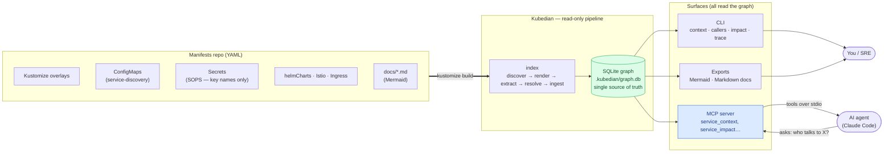

# Kubedian

**A Kubernetes-native tool to understand how your services actually relate — reconstructed straight from the manifests that define your cluster.**

Kubernetes describes *what* runs, pod by pod, but it never tells you *how your services fit
together*. Kubedian reads your manifests the way an SRE reads a cluster — across files,
namespaces and overlays — and reconstructs the service graph that Kubernetes itself never
exposes.

> README also available in [Español](README.es.md) and [Português](README.pt.md).

## What it's for

Kubedian builds a queryable **dependency graph between your services**: who calls whom over
HTTP, which database / cache / queue each one uses, and which external APIs it depends on.
It extracts all of this **directly from the YAML you already have** — Kustomize overlays,
Deployment env vars, shared ConfigMaps, Helm charts, Istio/Ingress routing — and exposes it
as a SQLite graph, a CLI, an MCP server for AI agents, Mermaid diagrams, and Markdown docs.

## The problem it solves

Most tooling around Kubernetes manifests stops at a *single file*: it deploys YAML,
templates YAML, lints YAML, or diffs YAML. **Almost none of it reads *across* the manifests to
answer the question that actually matters during an incident or a refactor — "what talks to
what?"** So teams fall back to hand-drawn architecture diagrams that drift out of date the day
after they're made, or to grepping dozens of overlays by hand.

Kubedian closes that gap. It treats the whole manifests repository as one graph and
reconstructs the **service topology** from the deployment reality, so the answer to
"what depends on `orders-service`?" or "what breaks if this database goes down?" is one
command (or one question to your AI agent) away — and always current, because it's derived
from the manifests, not maintained by hand.

It does this **without ever decrypting secrets**: it reads only the *key names* of
SOPS-encrypted secrets (which stay in plaintext), never their values.

## Install

```bash
uv tool install kubedian            # or: pipx install kubedian
uvx kubedian index --repo ./manifests   # run once without installing
pip install kubedian                 # core: index + graph + diagrams + docs
pip install "kubedian[mcp]"          # + MCP server
```

Requires the external [`kustomize`](https://kustomize.io) binary on `PATH` for accurate
rendering; Kubedian falls back to raw-YAML parsing if it's missing.

## Usage

```bash
# 1. Index the manifests repo (defaults to the current directory)
kubedian index --env production

# 2. Query the topology
kubedian status
kubedian context  orders-service        # who calls it, what it calls, datastores, externals
kubedian callers   catalog-service      # incoming dependencies
kubedian callees   orders-service        # outgoing dependencies
kubedian trace     checkout-service orders-service
kubedian impact    catalog-service      # blast radius if it fails
kubedian datastore-clients "db:postgres"   # who uses a datastore

# 3. Visualize / document
kubedian export-mermaid --focus orders-service   # architecture as a Mermaid diagram
kubedian export-docs    --lang all                 # Markdown docs (en/es/pt)

# 4. Serve to AI agents (e.g. Claude Code) over MCP
kubedian install        # registers the MCP server
kubedian serve          # or run it directly (stdio)
```

Add `--json` to any query command for machine-readable output, and `--env` to target a
specific environment (development | staging | production | test).

## Examples — who talks to whom?

**Who calls a service?**

```console
$ kubedian callers catalog-service --env production
 - checkout-service   (explicit, service-discovery.CATALOG_API_URL)
 - orders-service     (explicit, service-discovery.CATALOG_API_URL)
 - pricing-service    (explicit, service-discovery.CATALOG_API_URL)
 - promo-service      (explicit, service-discovery.CATALOG_API_URL)
 - inventory-service  (explicit, service-discovery.CATALOG_API_URL)
 - delivery-service   (explicit, service-discovery.CATALOG_API_URL)
 - auth-service       (explicit, service-discovery.CATALOG_API_URL)
 - web-frontend       (explicit, service-discovery.CATALOG_API_URL)
 - erp-connector      (explicit, service-discovery.CATALOG_API_URL)
```

**What does a service talk to?**

```console
$ kubedian callees checkout-service --env production
 - http_calls → catalog-service   (explicit)
 - http_calls → orders-service    (explicit)
 - http_calls → auth-service      (explicit)
 - reads_from → postgres          (heuristic)
 - caches_in  → redis             (documented)
 - queues_to  → rabbitmq          (heuristic)
```

### How Kubedian determines "who talks to whom"

It never runs the cluster — it reconstructs each edge from a concrete signal in the manifests
(or docs), and tags it with that signal so you can audit it:

| Signal in the YAML | Becomes the edge | Provenance |
|--------------------|------------------|------------|
| A service-discovery **ConfigMap** entry — `CATALOG_API_URL: http://catalog-service.catalog.svc.cluster.local` consumed via `envFrom` | `checkout-service → catalog-service` (`http_calls`) | `explicit` |
| A literal **env var** whose value is an in-cluster DNS name (`*.svc.cluster.local`) | caller → that service (`http_calls`) | `explicit` |
| A **secret key name** like `POSTGRES_HOST` / `RABBITMQ_HOST` / `REDIS_URL` (value stays encrypted) | service → its database / queue / cache | `heuristic` |
| A `*_URL` key pointing at a non-cluster host (e.g. `EMAIL_API_URL`) | service → external API | `heuristic` |
| A **Mermaid diagram** in your `docs/` drawing `A --> B` | `A → B` | `documented` |
| A `helmCharts[]` entry / a mounted ConfigMap or Secret | `depends_on_chart` / `references` | `explicit` |

So the answer to *"who talks to catalog-service?"* is derived from the exact ConfigMap key
each caller mounts — not from a diagram someone drew once. And when the only evidence is a
secret key name, the edge is honestly marked `heuristic` with the key cited, never as a fact.

**Trace a path or a blast radius:**

```console
$ kubedian trace web-frontend inventory-service --env production
 web-frontend → inventory-service   (reachable)

$ kubedian impact catalog-service --env production
 9 services depend on it (transitively)
```

## Enrich the graph from your docs

Some relationships aren't in the manifests at all — calls to external SaaS, cross-cluster
links, or backends whose address lives in an encrypted secret. If you already document those
in **Mermaid diagrams** inside your repo's docs, Kubedian can ingest them:

```bash
kubedian index --docs                 # also parse Mermaid diagrams under ./docs
kubedian index --docs-dir ./design    # or point at a specific folder
```

Edges parsed from docs are added with provenance `documented` (confidence 0.9). This connects
services that static manifest analysis alone would leave isolated, while keeping the
distinction clear: it's asserted by a human diagram, not inferred from the cluster config.

## How it works

From the manifests to your AI agent — the whole call flow:



Kubedian runs a **read-only pipeline** over the manifests repository. Nothing is applied to a
cluster and no secret is ever decrypted:

| Stage | What it does |
|-------|--------------|
| **discover** | Walks the repo and finds every renderable unit — the Kustomize overlays per service and environment. |
| **render** | Runs `kustomize build` on each overlay to get the real resolved objects (namespace transformer, patches, name prefixes). Falls back to raw-YAML parsing if an overlay won't build (e.g. a SOPS/ksops generator), so one broken service never aborts the index. |
| **extract** | Parses the rendered Kubernetes objects into typed views: Deployments and their env / `envFrom`, Services, ConfigMaps, Secrets (key names only), Helm chart refs, volume mounts, Istio/Ingress routing. |
| **resolve** | Turns resources into a graph: resolves in-cluster DNS (`*.svc.cluster.local`), the service-discovery ConfigMap URLs, secret-key heuristics (`POSTGRES_HOST` → a database), Helm dependencies and config mounts — each as an edge with provenance. |
| **ingest** *(optional, `--docs`)* | Parses Mermaid diagrams in your `docs/` and adds the edges they assert. |
| **store** | Writes nodes and edges to a local **SQLite** graph — the single source of truth. |
| **serve / export** | The CLI and the MCP server read the graph; exporters render it to Mermaid diagrams or Markdown docs. |

### Provenance — how much to trust each edge

| Provenance | Meaning |
|-----------|---------|
| `explicit` | The ConfigMap / manifest states it literally (e.g. a service-discovery URL). Confidence 1.0. |
| `documented` | Asserted by a Mermaid diagram in your docs. Confidence 0.9. |
| `heuristic` | Inferred from a secret key name like `POSTGRES_HOST`. Confidence < 1.0 — never presented as fact; the source key is always cited. |

### Architecture

Kubedian is written in **Python** following a clean, layered architecture so each concern stays
independent and testable:

- **domain** — the graph entities (nodes, edges, provenance) and resource views. No I/O. The
  `SecretView` here structurally exposes only key *names*, making value leaks impossible.
- **application** — the pipeline stages and the read-only query use-cases, shared verbatim by
  the CLI and the MCP server so both behave identically.
- **infrastructure** — the `kustomize` runner, the SQLite store/reader, and the Mermaid / docs
  exporters.
- **presentation** — the Typer CLI and the FastMCP tool definitions.

**Tech stack:** Python 3.11+, [`kustomize`](https://kustomize.io) (subprocess), SQLite
(standard-library, with recursive queries for trace/impact), [Typer](https://typer.tiangolo.com)
for the CLI, and [FastMCP](https://gofastmcp.com) for the MCP server. The SQLite graph is the
single source of truth; every other surface reads from it.

## Author

Created and maintained by **Yancel Salinas** (<yancel.salinas@gmail.com>).

## License

Apache-2.0
