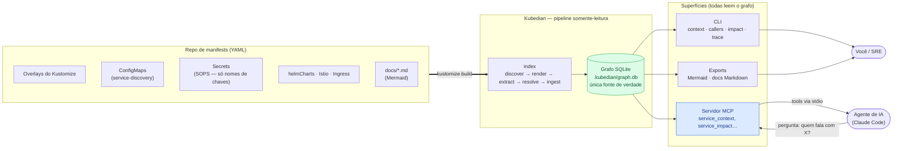

# Kubedian

**Uma ferramenta nativa de Kubernetes para entender como seus serviços realmente se relacionam — reconstruído diretamente dos manifests que definem seu cluster.**

O Kubernetes descreve *o que* roda, pod a pod, mas nunca te diz *como seus serviços se
encaixam*. O Kubedian lê seus manifests como um SRE lê um cluster — ao longo de arquivos,
namespaces e overlays — e reconstrói o grafo de serviços que o próprio Kubernetes nunca expõe.

> README também disponível em [English](README.md) e [Español](README.es.md).

## Para que serve

O Kubedian constrói um **grafo de dependências entre seus serviços**: quem chama quem por HTTP,
qual banco de dados / cache / fila cada um usa e de quais APIs externas depende. Ele extrai tudo
isso **direto do YAML que você já tem** — overlays do Kustomize, variáveis de ambiente dos
Deployments, ConfigMaps compartilhados, Helm charts, roteamento Istio/Ingress — e o expõe como
um grafo SQLite, uma CLI, um servidor MCP para agentes de IA, diagramas Mermaid e documentação
em Markdown.

## O problema que resolve

Quase toda ferramenta em torno de manifests Kubernetes para em um *arquivo individual*:
aplica YAML, faz template, valida ou faz diff de YAML. **Quase nenhuma lê *ao longo* dos
manifests para responder o que realmente importa num incidente ou numa refatoração: "o que fala
com o quê?"** Então os times recorrem a diagramas de arquitetura desenhados à mão que ficam
desatualizados no dia seguinte, ou a grepar dezenas de overlays manualmente.

O Kubedian fecha essa lacuna. Trata o repositório de manifests inteiro como um único grafo e
reconstrói a **topologia de serviços** a partir da realidade do deploy, de modo que a resposta
para "o que depende de `orders-service`?" ou "o que quebra se este banco cair?" está a um
comando (ou a uma pergunta ao seu agente de IA) de distância — e sempre atualizada, porque é
derivada dos manifests, não mantida à mão.

E faz isso **sem nunca descriptografar secrets**: lê apenas os *nomes das chaves* dos secrets
criptografados com SOPS (que ficam em texto puro), nunca seus valores.

## Instalação

```bash
uv tool install kubedian            # ou: pipx install kubedian
uvx kubedian index --repo ./manifests   # rode uma vez sem instalar
pip install kubedian                 # core: index + grafo + diagramas + docs
pip install "kubedian[mcp]"          # + servidor MCP
```

Requer o binário externo [`kustomize`](https://kustomize.io) no `PATH` para renderização
precisa; o Kubedian recorre ao parsing de YAML bruto se ele faltar.

## Uso

```bash
# 1. Indexar o repo de manifests (padrão: diretório atual)
kubedian index --env production

# 2. Consultar a topologia
kubedian status
kubedian context  orders-service        # quem o chama, o que ele chama, datastores, externos
kubedian callers   catalog-service      # dependências de entrada
kubedian callees   orders-service        # dependências de saída
kubedian trace     checkout-service orders-service
kubedian impact    catalog-service      # blast radius se falhar
kubedian datastore-clients "db:postgres"   # quem usa um datastore

# 3. Visualizar / documentar
kubedian export-mermaid --focus orders-service   # arquitetura como diagrama Mermaid
kubedian export-docs    --lang all                 # docs em Markdown (en/es/pt)

# 4. Expor a agentes de IA (ex.: Claude Code) via MCP
kubedian install        # registra o servidor MCP
kubedian serve          # ou rode direto (stdio)
```

Adicione `--json` a qualquer comando de consulta para saída processável, e `--env` para mirar
um ambiente específico (development | staging | production | test).

## Exemplos — quem fala com quem?

**Quem chama um serviço?**

```console
$ kubedian callers catalog-service --env production
 - checkout-service   (explicit, service-discovery.CATALOG_API_URL)
 - orders-service     (explicit, service-discovery.CATALOG_API_URL)
 - pricing-service    (explicit, service-discovery.CATALOG_API_URL)
 - promo-service      (explicit, service-discovery.CATALOG_API_URL)
 - inventory-service  (explicit, service-discovery.CATALOG_API_URL)
 - delivery-service   (explicit, service-discovery.CATALOG_API_URL)
 - auth-service       (explicit, service-discovery.CATALOG_API_URL)
 - web-frontend       (explicit, service-discovery.CATALOG_API_URL)
 - erp-connector      (explicit, service-discovery.CATALOG_API_URL)
```

**Com o que um serviço fala?**

```console
$ kubedian callees checkout-service --env production
 - http_calls → catalog-service   (explicit)
 - http_calls → orders-service    (explicit)
 - http_calls → auth-service      (explicit)
 - reads_from → postgres          (heuristic)
 - caches_in  → redis             (documented)
 - queues_to  → rabbitmq          (heuristic)
```

### Como o Kubedian determina "quem fala com quem"

Ele nunca roda o cluster — reconstrói cada aresta a partir de um sinal concreto nos manifests
(ou docs) e a marca com esse sinal para você poder auditá-la:

| Sinal no YAML | Aresta gerada | Proveniência |
|---------------|---------------|--------------|
| Uma entrada do **ConfigMap** de service-discovery — `CATALOG_API_URL: http://catalog-service.catalog.svc.cluster.local` consumida via `envFrom` | `checkout-service → catalog-service` (`http_calls`) | `explicit` |
| Uma **env var** literal cujo valor é um DNS interno (`*.svc.cluster.local`) | quem a define → esse serviço (`http_calls`) | `explicit` |
| O **nome de uma chave de secret** como `POSTGRES_HOST` / `RABBITMQ_HOST` / `REDIS_URL` (o valor segue criptografado) | serviço → seu banco / fila / cache | `heuristic` |
| Uma chave `*_URL` apontando para um host fora do cluster (ex.: `EMAIL_API_URL`) | serviço → API externa | `heuristic` |
| Um **diagrama Mermaid** no seu `docs/` desenhando `A --> B` | `A → B` | `documented` |
| Uma entrada `helmCharts[]` / um ConfigMap ou Secret montado | `depends_on_chart` / `references` | `explicit` |

Assim, a resposta para *"quem fala com catalog-service?"* é derivada da chave exata do
ConfigMap que cada chamador monta — não de um diagrama que alguém desenhou uma vez. E quando a
única evidência é o nome de uma chave de secret, a aresta é marcada honestamente como
`heuristic` citando a chave, nunca como um fato.

**Traçar um caminho ou o blast radius:**

```console
$ kubedian trace web-frontend inventory-service --env production
 web-frontend → inventory-service   (reachable)

$ kubedian impact catalog-service --env production
 9 serviços dependem dele (transitivamente)
```

## Enriquecer o grafo a partir da sua documentação

Algumas relações não estão nos manifests: chamadas a SaaS externos, links entre clusters ou
backends cujo endereço vive em um secret criptografado. Se você já documenta isso em **diagramas
Mermaid** dentro da documentação do repo, o Kubedian pode ingeri-los:

```bash
kubedian index --docs                 # também parseia os diagramas Mermaid em ./docs
kubedian index --docs-dir ./design    # ou aponte para uma pasta específica
```

Arestas extraídas dos docs são adicionadas com proveniência `documented` (confiança 0.9). Isso
conecta serviços que a análise estática de manifests deixaria isolados, mantendo clara a
distinção: é afirmado por um diagrama humano, não inferido da config do cluster.

## Como funciona

Do manifest ao seu agente de IA — todo o fluxo de chamada:



O Kubedian roda um **pipeline somente-leitura** sobre o repositório de manifests. Nada é
aplicado a um cluster e nenhum secret é descriptografado:

| Etapa | O que faz |
|-------|-----------|
| **discover** | Percorre o repo e encontra cada unidade renderizável — os overlays do Kustomize por serviço e ambiente. |
| **render** | Roda `kustomize build` em cada overlay para obter os objetos resolvidos reais (transformer de namespace, patches, prefixos de nome). Recorre ao parsing de YAML bruto se um overlay não compilar (ex.: um generator SOPS/ksops), então um serviço quebrado nunca aborta o índice. |
| **extract** | Parseia os objetos Kubernetes em views tipadas: Deployments e seu env / `envFrom`, Services, ConfigMaps, Secrets (só nomes de chaves), refs de Helm, volumes montados, roteamento Istio/Ingress. |
| **resolve** | Transforma recursos em grafo: resolve DNS interno (`*.svc.cluster.local`), as URLs do ConfigMap de service-discovery, heurísticas de chaves de secrets (`POSTGRES_HOST` → um banco), dependências de Helm e configs montadas — cada uma como aresta com proveniência. |
| **ingest** *(opcional, `--docs`)* | Parseia os diagramas Mermaid do seu `docs/` e adiciona as arestas que eles afirmam. |
| **store** | Escreve nós e arestas num grafo **SQLite** local — a única fonte de verdade. |
| **serve / export** | A CLI e o servidor MCP leem o grafo; os exporters o renderizam em diagramas Mermaid ou docs em Markdown. |

### Proveniência — o quanto confiar em cada aresta

| Proveniência | Significado |
|-----------|---------|
| `explicit` | O ConfigMap / manifest declara literalmente (ex.: uma URL de service-discovery). Confiança 1.0. |
| `documented` | Afirmado por um diagrama Mermaid na sua documentação. Confiança 0.9. |
| `heuristic` | Inferido do nome de uma chave de secret como `POSTGRES_HOST`. Confiança < 1.0 — nunca apresentado como fato; a chave de origem é sempre citada. |

### Arquitetura

O Kubedian é escrito em **Python** seguindo uma arquitetura limpa em camadas, para que cada
responsabilidade fique independente e testável:

- **domain** — as entidades do grafo (nós, arestas, proveniência) e as views de recursos. Sem
  I/O. Aqui o `SecretView` expõe estruturalmente apenas *nomes* de chaves, tornando impossível
  vazar valores.
- **application** — as etapas do pipeline e os use-cases de consulta somente-leitura,
  compartilhados verbatim pela CLI e pelo servidor MCP para que ambos se comportem igual.
- **infrastructure** — o runner do `kustomize`, o store/reader do SQLite e os exporters de
  Mermaid / docs.
- **presentation** — a CLI com Typer e as tools do servidor FastMCP.

**Stack:** Python 3.11+, [`kustomize`](https://kustomize.io) (subprocesso), SQLite (stdlib, com
queries recursivas para trace/impact), [Typer](https://typer.tiangolo.com) para a CLI e
[FastMCP](https://gofastmcp.com) para o servidor MCP. O grafo SQLite é a única fonte de verdade;
todas as outras superfícies leem dele.

## Autor

Criado e mantido por **Yancel Salinas** (<yancel.salinas@gmail.com>).

## Licença

Apache-2.0
